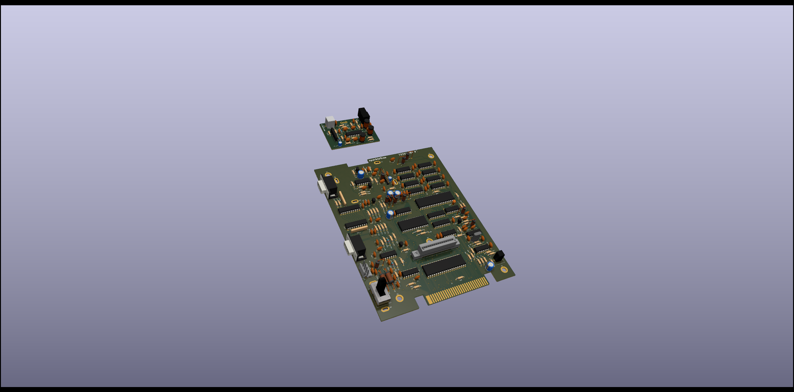

# Righteous Tentacle, Colecovision Reverse Engineering Project
### Schematic and PCB reproduction.

---

  author: Jay Convertino

  date: 2023.03.01

  details: Reverse engineer original PCB to create a schematic and functional replacment board. This only includes the NTSC system.

  license: MIT

---

## LICENSE
  - All files related to or generated from the KiCAD source fall under the MIT license.
  - All files generated by me, Jay Convertino, fall under the MIT license.
  - All files from other sources fall under the license of their specification.

## RELEASE VERSIONS
### Current
  - 1.0.0.F - initial release of revision F main PCB

### Past
  - DEV

## Wiki
  - Please see the [Wiki](../../wiki) for various information.

## Parts list
  - [Link to Wiki Parts list for the original console](../../wiki/Detailed-Part-Listing-For-Original)
  - [Link to Wiki Parts list for ordering parts](../../wiki/Detailed-Part-Listing-For-Orders)

## Intro

  This recreation of the PCB is for documenation, and reproduction purposes. This mimicks the PCB of the original NTSC revision F main board.

## SOURCES
### Schematic Check
  - Atari HQ Schematic : https://wiki.console5.com/wiki/Colecovision : Dan Boris
  - Atari Age : https://forums.atariage.com/topic/285656-new-colecovision-schematics/ : ChildOfCV

  Special thanks to ChildOfCV. Using his as a check for mine after buzzing out my own board was a great help. His schematic on
  its own is a great resource.

  Did find a few issues with mine vs the ChildOfCV version, my board is a different revision so they will differ in subtle ways.
  Seems to be mostly just cap and resistor values in the RF circuit. Though I did adjust my values on the clock to reflect those
  recommend in the tech manual.

  The Dan Boris schematic is ok, has a few mistakes that I can't recall at the moment. Mentioning it since I did look at it, but
  due to its issues I didn't use it.

## REQUIREMENTS
  - KiCAD v6.X

## BUILD TIPS
  This design is made so anyone can build this. You may send it out to a fab house, you may use a PCB mill, or even etch it.
  This is possible since the components can serve as the plated through hole. Other holes can simply have a solid piece of
  wire inserted and soldered to complete the connection (excess resistor leads is a great option).

  Recommend soldering the cartridge connector first, the CPU makes soldering one side of the pins a bit difficult to do
  without melting the connector.

  There are various questionable routings, these are how the original is done. Some adjustments were made to make some things easier
  for at home builders without plated through holes.

## FILE INFORMATION
  - README.md, is this file.
  - LICENSE.md, is the license file (MIT) for anything create by me, Jay Convertion, that resides in this repository.
  - doc, contains various documents used.
    - datasheets, contains parts used on the original board.
    - refs, sources used for checks
      - Coleco_ADAM_Schematic_-_Delta_Game.png, publicly available schematic of the ADAM
      - Coleco.zip, ChildOfCV schematic for the console and other various parts of the colecovision.
      - colecovision_atari_hq_schematic.pdf, Colecovision console schematic has errors.
      - tms-doc-annotated.pdf, TMS design document corrected by Nicholas Piegdon
  - models, PCB items and case designes
    - component_search_engine
    - FreeCAD
      - case, 3D printable case for the console.
      - parts, parts designed for the PCB by myself and future contributions.
  - pics, images take by me or others(watermark added) of the colecovision.
    - 3D, images generated by modeling tools.
    - control_pcb, pics of a different Colecovision console pcb (different REV) for comparison.
    - control_unit, pics of a different Colecovision console for comparison.
    - outside_sources, external sources with added watermark.
    - reverse_high_res, scans from a Canon 9600 DPI flatbed scanner of the PCB boards. Compressed to save space.
    - tear_down, images of the parts as they came apart.
    - signals
      - digital, all digital analyzer captures
      - analog, all analog scope captures
  - schematic, contains KiCAD schematic files.
    - coleco_original.kicad_pro, this file is the main project file that contains EVERTHING.
    - *-backups, are folders KiCAD creates to backup the project.
    - PCB_TOOLS
      - gerber, containts all exports from KiCAD
        - main, base PCB
        - rf, modulator PCB
      - GIMP_Placement_Tool, gimp project used to help place parts in the correct locations.
      - main, contains the main PCB extracted from the main project for production.
      - rf, contains RF PCB extracted from the main project for production.
    - lib, external components for KiCAD
      - CONNECTOR_PCBEdge_EXT
      - LOGOS
      - MHPS2273
      - MODELS
      - MOUNTS
      - OS102011MA1QN1
      - PADS
      - POWER_SYMBOLS
      - RCJ-041
      - RF_MODULATORS
      - SWITCHES_THT
      - TE_550841-2
      - VARIABLE_INDUCTORS
      - VINTAGE_AUDIO_SYNTH
      - VINTAGE_RAM
      - VINTAGE_VDP
    - PDF, various KiCAD exports in the PDF format. PCB and/or schematics.

## PCB IMAGE

