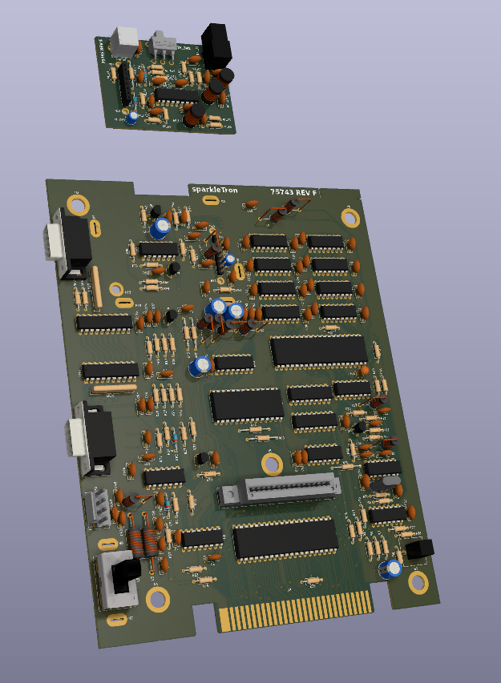

# Righteous Tentacle, Colecovision Reverse Engineering Project
### Schematic and PCB reproduction.

---

  author: Jay Convertino

  date: 2023.03.01

  details: Reverse engineer original PCB to create a schematic and functional replacment board.

  license: MIT

---

## TODO
  - So much, Wiki fixes, documents, and PCB build and checks.

## LICENSE
  - All files related to or generated from the KiCAD source fall under the MIT license.
  - All files from other sources fall under any license of their specification.

## RELEASE VERSIONS
### Current
  - DEV

### Past
  - None

## PROCESS IDEAS
  - FIRST: Reverse engineer without outside resources. Only a internal reverse engineering of the board for the schematic.
  - SECOND: Use outside schematic resources to check, then verify those against the board to see who was right.
  - THIRD: Create a PCB based upon the orignal, make it close but not exact.

## SOURCES
### Schematic Check
  - Atari HQ Schematic : https://wiki.console5.com/wiki/Colecovision : Dan Boris
  - Atari Age : https://forums.atariage.com/topic/285656-new-colecovision-schematics/ : ChildOfCV

  Did find a few issues with mine vs the ChildOfCV version, my board is a different revision so they will differ in subtle ways.
  Special thanks to ChildOfCV, his schematic is great.

  The Dan Boris schematic is ok, has a few mistakes that I can't recall at the moment. Mentioning it since I did look at it, but
  due to its issues I didn't use it.

## REQUIREMENTS
  - KiCAD v6.X
  - PDF Viewer
  - PCB Production

## BUILD TIPS
  - TIPS TO BUILD

## FILE INFORMATION
  - ALL BE THE FILES

## PCB IMAGE

